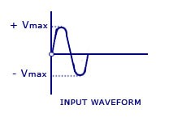
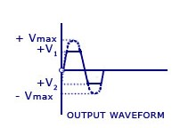
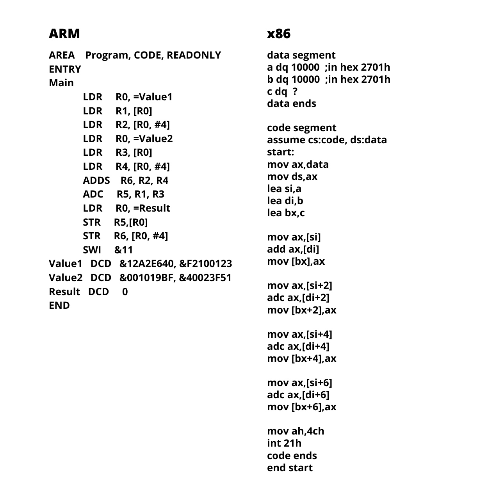

---

# 1
## Question
You have been recruited by a company that manufactures CPUs. The task of
developing a prototype ALU for an upcoming CPU is given to you. The CPU is
meant to work with signed (2’s complement) 8-bit numbers. An ALU has several
control signals that select what operation is to be performed. The design
specifications are as follows:

\centering
\begin{tabular}{|c|c|c|c|}
	\hline
	Name & Type & Size & Description \\
	\hline
	\multicolumn{4}{| c |}{PRIMARY INPUTS} \\
	\hline
	x & Input & 8-bit, signed & Operand 1 \\
	y & Input & 8-bit, signed & Operand 2 \\
	\hline
	\multicolumn{4}{| c |}{PRIMARY OUTPUT} \\
	\hline
	out & Input & 8-bit, signed & Final result after computation \\
	\hline
	\multicolumn{4}{| c |}{CONTROL SIGNALS} \\
	\hline
	nx & Input & 1-bit & If set, perform 2's complement of the operand 'x' \\
	ny & Input & 1-bit & If set, perform 2's complement of the operand 'y' \\
	f & Input & 1-bit & If set, perform 'x + y' (addition), else perform 'x AND y' \\
	\hline
	\multicolumn{4}{| c |}{FLAGS} \\
	\hline
	zr & Output & 1-bit & If 'out' is zero, set to '1', else set to '0'\\
	ng & Output & 1-bit & If 'out' is negative, set to '1', else set to '0'\\
	\hline
\end{tabular}

\raggedright
The ALU must be able to produce the following outputs making use of the
different control signals:

* `x + y`
* `x - y`
* `y - x`
* `x AND y`

Also, provide a truth table for the control signals and the output they
produce.

## Answer
You can find the simulation
[here](https://circuitverse.org/users/3903/projects/electronika-alu)

Control signal table:

\begin{tabular}{|c|c|c|c|}
	\hline
	nx & ny & f & out \\
	\hline
	0 & 0 & 1 & x + y \\
	0 & 1 & 1 & x - y \\
	1 & 0 & 1 & y - x \\
	0 & 0 & 0 & x AND y \\
	\hline
\end{tabular}

**PTO.**

\pagebreak

{width=70%}

---

# 2
## Question
For the given circuit, what will be the state of each flip-flop after 4 clock
cycles(enter 4 bit binary answer)?


## Answer
`0101`

You can find the simulation
[here](https://circuitverse.org/users/3903/projects/lfsr)

---

# 3
## Question
What is the parity bit for the word `1101010100001011`?

## Answer
`0`

---

# 4
## Question
You are trying to reverse engineer a logic board. You see that a couple of
lines that you are probing give the following output on an oscilloscope.
Decipher what protocol is being used and what message is being sent.

{width=60%}

## Answer
[I2C protocol](https://www.circuitbasics.com/basics-of-the-i2c-communication-protocol/), `00101001`

'X' is the `SCL` line and 'Y' is the `SDA` line

---

# 5
## Question
Represent the given 8-bit numbers in the Big-Endian format, given a word-length
of 4 bits: 11010111, 00101101 (answer must be comma-separated values of each
row)

## Answer
`1101`, `0111`, `0010`, `1101`

In memory, it would look like this:

\begin{tabular}{|c|c|}
	\hline
	Address 0 & 1101 \\
	\hline
	Address 1 & 0111 \\
	\hline
	Address 2 & 0010 \\
	\hline
	Address 3 & 1101 \\
	\hline
\end{tabular}

---

# 6
## Question
Identify the logic function of the following circuit

**PTO.**


## Answer
XOR

---

# 7
## Question
Guess the component: It is used to attenuate high-frequency electromagnetic
interference (EMI) in a circuit.  It works like a low pass filter that allows
only low-frequency signals to pass through a circuit and eliminates the
high-frequency noise.

## Answer
[Ferrite bead](https://en.wikipedia.org/wiki/Ferrite_bead)

---

# 8
## Question
To obtain the output waveform 'Y' from the input waveform 'X', design the
circuit block 'A'


## Answer
The technique used is amplitude modulation (AM), and requires an envelope
detector along with a low-pass filter for demodulation.

{width=60%}

---

# 9
## Question
Determine the type of filter from the following transfer function:

$$
T(s) = a\frac{(s^2 + \omega_n^2)}{(s^2 + s\frac{\omega_0}{Q} + \omega_0^2)}
\quad  (\omega_n \geq \omega_0)
$$

## Answer
Low-pass notch filter

---

# 10
## Question
What is the output voltage '$V_o$' of the circuit if the input voltage is 5 V?


## Answer
5 V

This is an op-amp that is wired up as a voltage follower.

---

# 11
## Question
Given the input, which of the following circuits gives the required output?

 

## Answer
A biased, double-ended clipper is needed to produce the given output.

{width=50%}

---

**PTO.**

\pagebreak

---

# 12
## Question
Find the output voltage of the circuit shown below.

{width=45%}

## Answer
$6V_1 + 4V_2$

---

# 13
## Question
Design a filter using an op-amp for the given transfer function:
$$
T(s) = -a\frac{(s - \omega_0)}{(s + \omega_0)}
$$

## Answer
The filter is an all-pass filter

Here, $RC = \frac{1}{\omega_0}$

{width=50%}

---

# 14
## Question
Construct a CMOS logic circuit that realises the given truth table.

| A | B | C | Output |
|:-:|:-:|:-:|:------:|
| F | F | F |    T   |
| F | F | T |    T   |
| F | T | F |    T   |
| F | T | T |    F   |
| T | F | F |    F   |
| T | F | T |    F   |
| T | T | F |    F   |
| T | T | T |    F   |

## Answer
The simplified boolean expression is `A'B' + A'C'` which is equivalent to `(A + BC)'`

{width=80%}

---


# 15
## Question
Simplify the Boolean expression Y = A'B'C' + A'B'C + A'BC' + AB'C' + ABC'

## Answer
Y = A'B' + C'

---

# 16
## Question
What are the three essential components required for high voltage switching
using MCUs?

## Answer
Optocoupler, Darlington transistor, Relay

---

# 17
## Question
Consider a 4 bit Johnson counter with an initial value of `0111`. What is the
counting sequence of this counter? (Answer in decimal)

## Answer
7, 3, 1, 0, 8, 12, 14, 15, 7

---

# 18
## Question
Rahul has just realized that polynomial multiplication is just the linear
convolution of the coefficients. Help him build a hardware circuit for
performing linear convolution using a hardware description language.

## Answer
This solution is written in Verilog HDL. It is a module that performs linear
convolution on two 8-bit numbers.

```verilog
module linear_convolution(A,B,R);

	input [7:0] A, B;
	output [15:0] R;

	wire A0, A1, A2, A3, A4, A5, A6, A7;
	wire B0, B1, B2, B3, B4, B5, B6, B7;
	wire C1, C2, C3, C4, C5, C6, C7, C8, C9, C10, C11, C12, C13, C14;
	wire R0, R1, R2, R3, R4, R5, R6, R7, R8, R9, R10, R11, R12, R13, R14;

	assign A0 = A[0];
	assign A1 = A[1];
	assign A2 = A[2];
	assign A3 = A[3];
	assign A4 = A[4];
	assign A5 = A[5];
	assign A6 = A[6];
	assign A7 = A[7];

	assign B0 = B[0];
	assign B1 = B[1];
	assign B2 = B[2];
	assign B3 = B[3];
	assign B4 = B[4];
	assign B5 = B[5];
	assign B6 = B[6];
	assign B7 = B[7];

	assign R0 = A0 && B0 ;
	assign {C1, R1} = (A0 & B1) + (A1 & B0); // Continued on next page
	assign {C2, R2} = C1 + (A0 && B2) + (A2 && B0) + (A1 && B1);
	assign {C3, R3} = C2 + (A3 && B0) + (A0 && B3) + (A1 && B2) + (A2 && B1);
	assign {C4, R4} = C3 + (A4 && B0) + (A0 && B4) + (A3 && B1) + (A1 && B3) + (A2 && B2);
	assign {C5, R5} = C4 + (A5 && B0) + (A0 && B5) + (A4 && B1) + (A1 && B4) + (A3 && B2) + (A2 && B3);
	assign {C6, R6} = C5 + (A6 && B0) + (A0 && B6) + (A5 && B1) + (A1 && B5) + (A4 && B2) + (A2 && B4)  + (A3 && B3 );
	assign {C7, R7} = C6 + (A7 && B0) + (A0 && B7) + (A6 && B1) + (A1 && B6) + (A5 && B2) + (A2&&B5) + (A4&&B3) + (A3&&B4);
	assign {C8, R8} = C7 + (A7 && B1) + (A1 && B7) + (A6 && B2) + (A2 && B6) + (A5 && B3) + (A3 && B5) + (A4 && B4) ;
	assign {C9, R9} = C8 + (A7 && B2) + (A2 && B7) + (A6 && B3) + (A3 && B6) + (A5 && B4) + (A4 && B5);
	assign {C10, R10} = C9 + (A7 && B3) + (A3 && B7) + (A6 && B4) + (A4 && B6) + (A5 && B5);
	assign {C11, R11} = C10 + (A7 && B4) + (A4 && B7) + (A6 && B5) + (A5 && B6);
	assign {C12, R12} = C11 + (A7 && B5) + (A5 && B7) + (A6 && B6);
	assign {C13, R13} = C12 + (A7 && B6) + (A6 && B7);
	assign {C14, R14} = C13 + (A7 && B7);
endmodule
```

---

# 19
## Question
Fibonacci numbers are incredibly easy to understand for right? Well here is a
new challenge! Design a digital circuit that generates all the Fibonacci
numbers between 0 and 15.

## Answer
The required sequence is 0, 1, 2, 3, 5, 8, 13, since we are not asking for the
Fibonacci series, but only the numbers. Since the largest number- 13 requires 4
bits, 4 flip-flops are required. T flip-flops are used in this solution. Let us
call them `T3, T2, T1, T0` (`T3` is the MSB and `T0` is the LSB). Similarly,
their outputs are `Q3, Q2, Q1, Q0` respectively.

\centering
\begin{tabular}{cccc|cccc}
	\hline
	\multicolumn{4}{c|}{Present State} & \multicolumn{4}{c}{Next State} \\
	\hline
	$Q_3$ & $Q_2$ & $Q_1$ & $Q_0$ & $Q_3^+$ & $Q_2^+$ & $Q_1^+$ & $Q_0^+$ \\
	\hline
	0     & 0     & 0     & 0     & 0       & 0       & 0       & 1 \\
	0     & 0     & 0     & 1     & 0       & 0       & 1       & 0 \\
	0     & 0     & 1     & 0     & 0       & 0       & 1       & 1 \\
	0     & 0     & 1     & 1     & 0       & 1       & 0       & 1 \\
	0     & 1     & 0     & 1     & 1       & 0       & 0       & 0 \\
	1     & 0     & 0     & 0     & 1       & 1       & 0       & 1 \\
	1     & 1     & 0     & 1     & 0       & 0       & 0       & 0 \\
	\hline
\end{tabular}

\raggedright

The inputs of each flip-flop for each count are obtained using the transition
table of the T flip-flop

| $T_3$ | $T_2$ | $T_1$ | $T_0$ |
|:-----:|:-----:|:-----:|:-----:|
|   0   |   0   |   0   |   1   |
|   0   |   0   |   1   |   1   |
|   0   |   0   |   0   |   1   |
|   0   |   1   |   1   |   0   |
|   1   |   1   |   0   |   1   |
|   0   |   1   |   0   |   1   |
|   1   |   1   |   0   |   1   |

Using K-maps for $T_n$, we can calculate the individual flip-flop inputs.

\centering
\begin{tabular}{|c|c|c|c|}
	\hline
	$T_3$ & $T_2$ & $T_1$ & $T_0$ \\
	\hline
	$Q_2$ & $Q_2 + Q_3 + (Q_1 . Q_0)$ & $Q_2' . Q_0$ & $Q_1' + Q_0'$ \\
	\hline
\end{tabular}

\raggedright

You can find the simulation
[here](https://circuitverse.org/users/3903/projects/fibonacci-counter)

**PTO.**

\pagebreak

{ width=40% }

---

# 20
## Question
Rahul is an Embedded Software developer. He was given two code snippets at
work, both of them perform the same function. Help him figure out what they do.

{ width=75% }

## Answer
Both programs perform the addition of two 64-bit numbers.

---

\pagebreak

---

# 21
## Question
Rahul found an old-tech memory solution that he knows how to write, but he's
not sure how to read the written data. Help him find written data.

{ width=60% }

## Answer
The figure represents a variation of ["Ferrite core
memory"](https://youtu.be/AwsInQLmjXc). This is technology from the 1950's, and
was famously used for the computers on NASA's Saturn V rocket! Each ring
represents a single bit of information, so here, there are 64 bits of data. If
the currents flowing into a ring add up to $i$, then a logical `1` is stored,
otherwise, a logical `0` is stored.

The data stored is as follows (row-wise, from top to bottom)-

\centering
\begin{tabular}{|c|c|c|c|c|c|c|c|}
	\hline
	0 & 0 & 0 & 0 & 0 & 0 & 0 & 0 \\
	\hline
	1 & 0 & 1 & 0 & 0 & 1 & 0 & 1 \\
	\hline
	0 & 0 & 0 & 0 & 0 & 0 & 0 & 0 \\
	\hline
	0 & 0 & 0 & 0 & 0 & 0 & 0 & 0 \\
	\hline
	0 & 0 & 0 & 0 & 0 & 0 & 0 & 0 \\
	\hline
	1 & 0 & 1 & 0 & 0 & 1 & 0 & 1 \\
	\hline
	0 & 0 & 0 & 0 & 0 & 0 & 0 & 0 \\
	\hline
	1 & 0 & 1 & 0 & 0 & 1 & 0 & 1 \\
	\hline
\end{tabular}

\raggedright

---

# 22
## Question
Can a 16-bit timer be realized using an 8-bit timer on an AVR
microcontroller (e.g. ATMEGA328p)? If yes, how?

## Answer
Yes, it can be done. **PTO.**

```c
// This sample program creates delay of 1 second on an ATMEGA328p
// ‘reg’ is a soft(ie it is not part of the hardware) 8-bit register
union reg {
	struct bitsy {
		unsigned int b0: 1;
		unsigned int b1: 1;
		unsigned int b2: 1;
		unsigned int b3: 1;
		unsigned int b4: 1;
		unsigned int b5: 1;
		unsigned int b6: 1;
		unsigned int b7: 1;
	} bits;
	int bytes: 8;
} x;

void init(int ocr) {
	DDRB |= (1 << PB5);
	cli();
	OCR0A = ocr;
	TCCR0A |= (1 << WGM01) | (1 << COM0A0);
	TCCR0B |= (1 << CS02) | (1 << CS00);
	TIMSK0 |= (1 << OCIE0A);
	sei();
}

void start(int millies) {
	int temp = 0;
	if (millies < 256) {
		init(millies);
	}
	else {
		temp = ceil(millies / 255.0);
		x.bytes = temp;

		while (x.bytes > 0) {
			init(255);
		}
	}
}

int main() {
	while (1) {
		start(17000);
		PORTB ^= (1 << PB5);
	}
}

ISR(TIMER0_COMPA_vect) {
	x.bytes -= 1;
}
```

---

# 23
## Question
Rahul wants to read and analyze heartbeat signals. Since heartbeat signals are
very low-level signals, help him design a differential amplifier with a high
CMRR, high gain, and high accuracy. The amplifier must provide a gain that can
be varied over the range of 2 to 1000 using a 100 $k\Omega$ potentiometer.

**PTO.**

\pagebreak

## Answer

{width=60%}

An instrumentation amplifier is required for this purpose (Why? because we
require high CMRR, gain and accuracy). The input voltages are taken via
electrodes on the skin, or through photo-transistors and an IR LED placed near
the skin. As shown in the figure, it is built in two stages. In the first
stage, $2R_1$ is taken as the series combination of a fixed resistance $R_{1f}$
and a variable resistance $R_{1v}$. The 100 $k\Omega$ potentiometer is used as
$R_{1v}$.

$$2R_1 = R_{1f} + R_{1v}$$

The second stage is usually kept at unity gain, therefore we can select the
values of $R_3$ and $R_4$ to be any practically convenient value, say
10 $k\Omega$. The equivalent gain of both stages combined is their product, so
if the gain of the first stage is $G$, the overall gain is $G \times 1$. Thus
the entire gain of the amplifier is provided by the first stage itself.

$$\text{It is given that }2 \leq G \leq 1000$$

$$\text{The gain of the first stage is given by }G = 1 + \frac{2R_2}{R_{1f} + R_{1v}}$$

$$\text{For maximum gain(i.e. 1000), take }R_{1v} = 0\ \Omega \text{ (minimum R)}$$

\begin{equation} \label{eq:max}
1 + \frac{2R_2}{R_{1f}} = 1000
\end{equation}

$$\text{For minimum gain(i.e. 2), take }R_{1v} = 100\ k\Omega \text{ (maximum R)}$$

\begin{equation} \label{eq:min}
1 + \frac{2R_2}{R_{1f} + 100\ k\Omega} = 2
\end{equation}

On solving equations \eqref{eq:max} and \eqref{eq:min}, we get $R_{1f} =
100.2\ \Omega$ and $R_2 = 50.050\ k\Omega$

Therefore, the entire design is as follows:

| Resistance |            Value            |
|:----------:|:---------------------------:|
|  $R_{1f}$  |        100.2 $\Omega$       |
|  $R_{1v}$  | 0 $\Omega$ to 100 $k\Omega$ |
|    $R_2$   |       50.050 $k\Omega$      |
|    $R_3$   |         10 $k\Omega$        |
|    $R_4$   |         10 $k\Omega$        |

---
